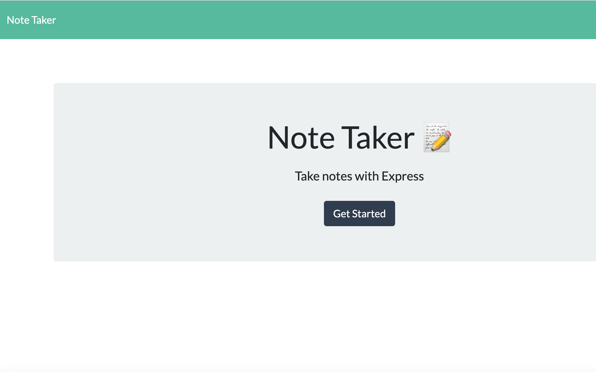
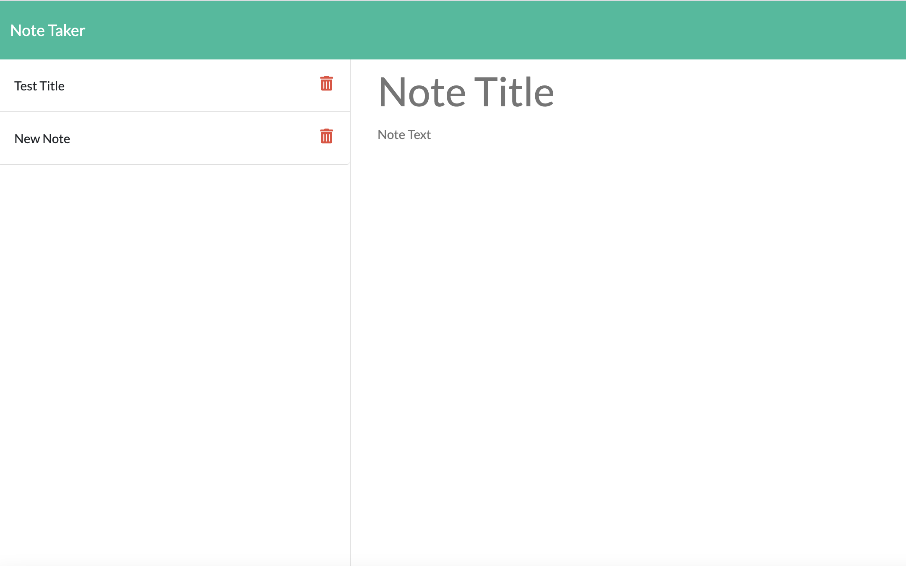

# Note-Taker

## Table of Contents
1. [Title](#title)
2. [Description](#Description)
3. [Installation](#Installation)
4. [Collaboration](#Collaboration)
5. [Steps](#Steps)
6. [Tests](#Tests)

Team Profile Generator

## General Info
The purpose of this task is to create an app that allows me to create and save notes
## Technologies 
The site uses HTML, CSS code, Javascript,node,js, Inquirer, Express

## Installation
* To access the website go to: https://github.com/MelElson/Note-Taker
* https://dry-sands-56365.herokuapp.com

# Collaboration 
Pulls are encouraged. Any changes document. 

# Steps
GIVEN a note-taking application
WHEN I open the Note Taker
THEN I am presented with a landing page with a link to a notes page
WHEN I click on the link to the notes page
THEN I am presented with a page with existing notes listed in the left-hand column, plus empty fields to enter a new note title and the note’s text in the right-hand column
WHEN I enter a new note title and the note’s text
THEN a Save icon appears in the navigation at the top of the page
WHEN I click on the Save icon
THEN the new note I have entered is saved and appears in the left-hand column with the other existing notes
WHEN I click on an existing note in the list in the left-hand column
THEN that note appears in the right-hand column
WHEN I click on the Write icon in the navigation at the top of the page
THEN I am presented with empty fields to enter a new note title and the note’s text in the right-hand column

	
    

### Team Generator Screenshot

### Team Generator Input

### Walkthrough

